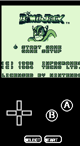
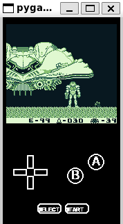
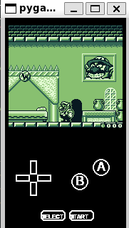
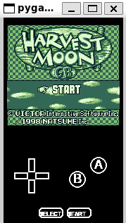

# hazelnut gameboy emulator
This is a gameboy emulator written solo with python and pygame, only for learning and fun.


## Some Screenshots





## Legal notice

hazelnut-gb-emu is an independent, non-commercial hobby project created
for educational and research purposes.

This project is not affiliated with, authorized by, sponsored by, or endorsed
by Nintendo Co., Ltd. or any of its subsidiaries.

Nintendo, Game Boy, Pokémon, Kirby, The Legend of Zelda, and other related
names and marks are trademarks or intellectual property of their respective
owners.

No copyrighted game ROMs, boot ROMs, firmware, encryption keys, or proprietary
game assets are distributed with this repository. Users are responsible for
providing any required game data from legally obtained sources.

Gameplay footage and screenshots are included solely to demonstrate emulator
compatibility. All rights to the depicted games and assets remain with their
respective owners.


## How to download and play

#### Clone the repo
```git clone https://github.com/atifcodesalot/hazelnut-gb-emu```

#### Install pygame
For unix generally:
```python3 -m pip install pygame```

on windows:
```py -m pip install pygame```


#### Run ROMS
On the repo root directory:
Unix:
```python3 -m hazelnut_gb_emu [Path to the rom file]```

Windows:

```py -m hazelnut_gb_emu [Path to the rom file]```


## Info on the emulator, disclaimers

- This emulator is currently not clock or machine cycle accurate: it does not emulate GameBoy hardware in full accuraccy. Due to this, you are likely to experience bugs every now and then.
- Due to the point above, it fails tests that expect full accurate hardware behaviour.
- It is in no way complete, just functional enough to run most commercial games.
- Only MBC1 and MBC3 are implemented for bank switching.
- It runs slower than the actual gameboy most of the time.
- The APU unit is not implemented yet, hence no sound.
- the STOP instruction isn't implemented yet.
- Serial transfer is not implemented yet, resulting in bugs in Alleyway for example.

## Credits and AI usage
%99 of the code and the full CPU, PPU implementation is written by me, only. Rarely, some functions were refactored, enchanced by AI: no code was generated from scratch.
AI was used extensively, only for; bug hunting, diassembly and optimization problems. 

## Known bugs

- Alleyway serial bug
- Street Fighter 2 periodically rendering giberrish due to PPU and CPU sync problems.
