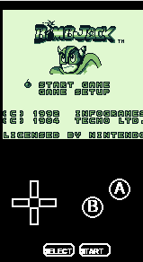
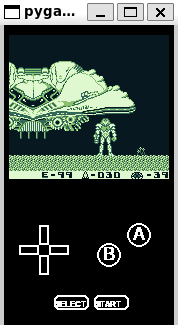
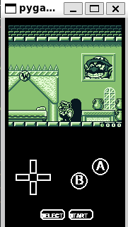
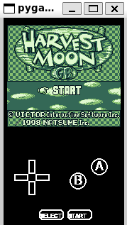

# Hazelnut gameboy emulator
This is a gameboy emulator written solo with python and pygame, only for learning and fun.


## Some Screenshots





## Legal notice

hazelnut-gb-emu is an independent, non-commercial hobby project created
for educational and research purposes.

This project is not affiliated with, authorized by, sponsored by, or endorsed
by Nintendo Co., Ltd. or any of its subsidiaries.

Nintendo, Game Boy, Pokémon, Kirby, The Legend of Zelda, and other related
names and marks are trademarks or intellectual property of their respective
owners.

No copyrighted game ROMs, boot ROMs, firmware, encryption keys, or proprietary
game assets are distributed with this repository. Users are responsible for
providing any required game data from legally obtained sources.

Gameplay footage and screenshots are included solely to demonstrate emulator
compatibility. All rights to the depicted games and assets remain with their
respective owners.


## How to download and play

## The PyPy runtime

The PyPy runtime is heavily recommended for this emulator, if you want real GameBoy speed.
Automatic installation is supported, and you will be prompted to; initially.

#### Clone the repo
```git clone https://github.com/atifcodesalot/hazelnut-gb-emu```

#### Install pygame
For unix generally:
```python3 -m pip install pygame```

on windows:
```py -m pip install pygame```


#### Run ROMS
On the repo root directory:
Unix:
```python3 -m hazelnut_gb_emu```

Windows:

```py -m hazelnut_gb_emu```

Choose if you want to download and use PyPy, by pressing y or n then enter,
afterwards choose a ROM file to play, simple.


## Info on the emulator, disclaimers

- This emulator is currently not clock or machine cycle accurate: it does not emulate GameBoy hardware in full accuraccy.
It is instead instruction stepped, due to this, you may experience bugs every now and then.
- It is in no way complete, but functional enough to run most commercial games.
- Only MBC1, MBC2 and MBC3 are implemented for bank switching (MBC5 is next :yum:).
- It sometimes runs slower than the actual gameboy (60 fps), except if you use PyPy, then it is 60 fps constantly.
- The APU unit is not implemented yet, hence no sound.
- the STOP instruction isn't implemented yet. :poop:
- Serial transfer is not implemented yet, resulting in bugs in Alleyway for example.

## Credits and AI usage
%99 of the code and the full CPU, PPU implementation is written by me, only. Rarely, some functions were refactored, enchanced by AI: no code was generated from scratch.
AI was used extensively, only for; bug hunting, disassembly and optimization problems. 

## Known bugs
- Alleyway and Mortal Kombat refuse to run due to serial transfer not being implemented yet
- ~Street Fighter 2 periodically rendering giberrish due to PPU and CPU sync problems~ (fixed)
- ~Super Star Wars character sprite not rendering~ (fixed, was due to missing hblank stat interrupts)
